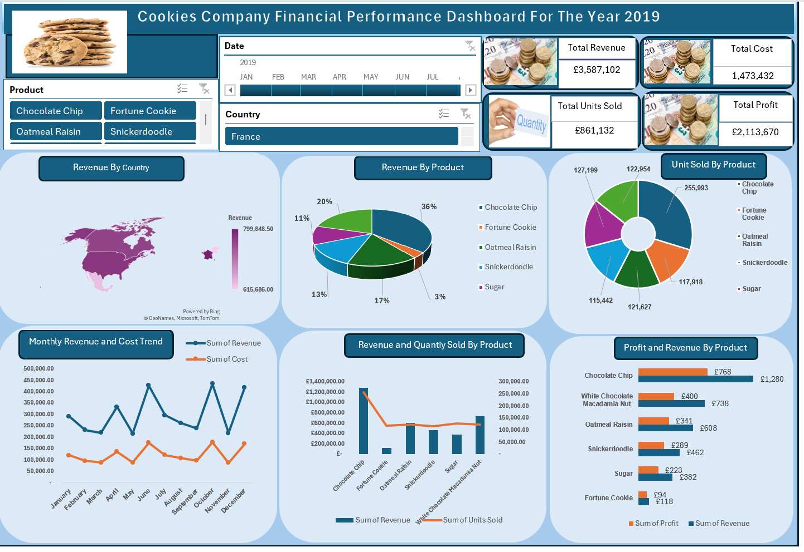

# Data Analytics Portfolio

# Project 1
**Title:** [Cookies Company Sales Performance Dashboard - Year 2019](https://github.com/D2AAROWOLO/Arowolo/blob/main/CookiesDBXlx.xlsx)

**Tools Used:** Microsoft Excel (Pivot Table, Pivot Chart, Slicer, Shapes, Textbox, Conditional Formatting, Custom Number Formatting, Chart Formatting)

**Project Description:** This project analyses the 2019 sales performance of a cookies company using an interactive Excel dashboard. The dataset includes product‑level sales, regional performance, and monthly trends. Using Pivot Tables, Pivot Charts, Slicers, and custom formatting, the dashboard provides a clear visual summary of how different cookie products performed throughout the year.

Key metrics such as total annual sales, top‑selling products, and monthly sales fluctuations are highlighted in the dashboard. Interactive slicers allow users to filter results by product type or region, making it easy to explore patterns and compare performance across categories. The Key Performance Indicators (KPIs) display total revenue, total cost, total profit, and total quantity sold.

**Key findings:**

**Dashboard Overview:**
 

