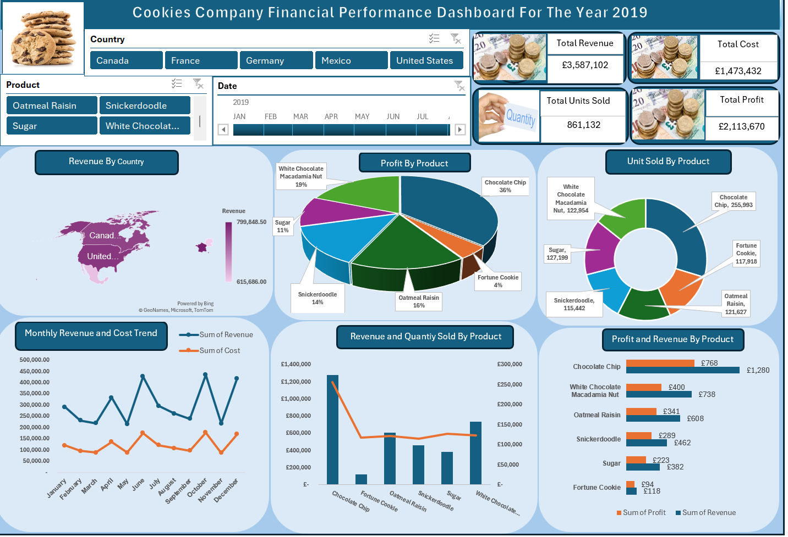

# Data Analytics Portfolio

# Project 1
**Title:** [Cookies Company Sales Performance Dashboard - Year 2019](https://github.com/D2AAROWOLO/Arowolo/blob/main/CookiesDBXlx.xlsx)

**Tools Used:** Microsoft Excel (Pivot Table, Pivot Chart, Slicer, Shapes, Textbox, Conditional Formatting, Custom Number Formatting, Chart Formatting)

**Project Description:** This project analyses the 2019 sales performance of a cookies company using an interactive Excel dashboard. The dataset includes product‑level sales, regional performance, and monthly trends. Using Pivot Tables, Pivot Charts, Slicers, and custom formatting, the dashboard provides a clear visual summary of how different cookie products performed throughout the year.

Key metrics such as total annual sales, top‑selling products, and monthly sales fluctuations are highlighted in the dashboard. Interactive slicers allow users to filter results by product type or region, making it easy to explore patterns and compare performance across categories. The Key Performance Indicators (KPIs) display total revenue, total cost, total profit, and total quantity sold.

**Key findings:** Overall Performance
The KPI cards show that the business generated strong total revenue (£3,587,102) in 2019, supported by healthy profit (£2,113,670) and a high total quantity (861,132) sold. This provides a clear snapshot of the company’s financial performance for the year.

Top Selling Products
Chocolate Chip is the highest selling product, generating the largest share of total sales (36%) and the highest quantity sold (255,993 units). It significantly outperforms all other cookie varieties, making it the primary driver of revenue. This product should remain a strategic focus for production planning and marketing investment.

Monthly Sales Trends
The line chart shows that sales peaked during the year, with October recording the highest sales and also the highest cost. This indicates that sales and cost of sales move in the same direction, suggesting effective cost management. Several months experienced noticeable dips, highlighting opportunities for targeted promotions or inventory adjustments during slower periods.

Regional Performance
The regional chart shows that France recorded the highest sales, contributing more to total revenue than any other region. This highlights where customer demand is strongest. Lower performing regions may benefit from improved distribution, local marketing initiatives, or adjustments to the product mix.

Interactive Filtering
Using slicers, stakeholders can immediately see how product performance varies by region and how regional trends shift across product categories. This dynamic filtering supports deeper exploration and faster, more informed decision making.

Conclusion
The dashboard provides clear visual insights using a combination of charts that show which products lead in revenue, how sales evolve month to month, and which regions drive the most value. These visuals help stakeholders quickly identify strengths, weaknesses, and potential growth opportunities.

**Dashboard Overview:**
 

